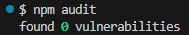

## Welcome to My GitHub Pages

 \
 

After leaving my Nextra blog untouched for almost two years, I tried to revive it. Next.js upgrades were mostly fine, but Nextra 4 was a breaking point.

I fixed the code until it ran again, only to find that pages no longer appeared in the navbar. Digging deeper, I discovered that Nextra introduced yet another convention, _meta.js, where you now have to explicitly declare pages instead of relying on the automatically generated page map.

At that point, I was done. I am not interested in babysitting framework-specific conventions just to render a navbar.

So I switched to Astro.

Astro has been noticeably more stable, with fewer breaking changes and far less framework magic. I found a theme I liked and used it as the base for this blog.

Theme: https://github.com/stelcodes/multiterm-astro

## Goodbye GitHub Dependabot !
