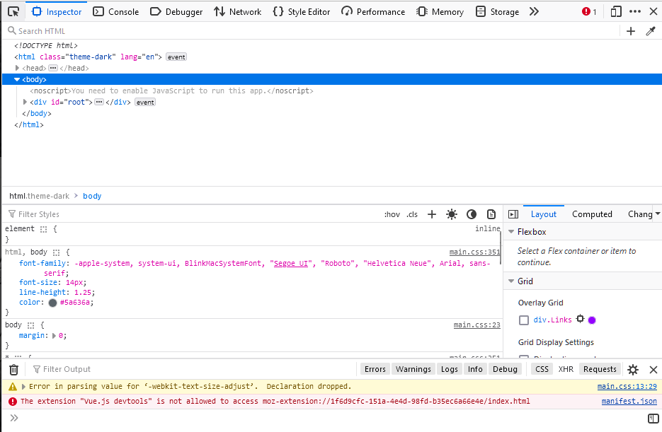

When I first got into programming during college, I was all about C, Python, and Java. Web development, with CSS and JavaScript, seemed like a whole different world. Fast forward to my new gig at a company, and I've spent months wading through the CSS waters. I want to share what I've learned and why I'm warming up to Cascading Style Sheets.

## The HTML Riddle

Fire up your favorite web browser and open a developer console. For me, I'm on Firefox so it's ctrl+shift+I.

Now, go to any website and click on the inspector tool. You'll see the HTML code that makes up the page. It's a tree-like structure of tags and content. 
Like this:  

```html
<html>
  <head>
    <title>My Page</title>
  </head>
  <body>
    <h1>My Page</h1>
    <p>My first paragraph</p>
  </body>
</html>
```

This is the HTML code for a simple page. It has a title, a heading, and a paragraph. The tags are the building blocks of the page. They tell the browser what to display and how to display it. But there's a catch.

## The HTML Challenge: It's Not Pretty

HTML is great for structuring content, but it's not so good at making it look good. You can't change the font size, color, or spacing. You can't even make a simple box. That's where CSS comes in.

## The CSS Riddle

CSS was a head-scratcher at the beginning. It didn't behave like the familiar programming languages I knew. But as I got into it, I started to decode its mysteries.

With CSS, you can dress up your web content. You make classes with your names and decide how they should look. Like this:

```css
.myFirstClass {
  /* CSS properties */
}
```

These classes can be imported into your HTML code:

```html
<div class="myFirstClass">
  <!-- HTML content -->
</div>

```
Everything inside this HTML tag adopts the specified CSS properties. But there's more.

## CSS Tricks: Targeting Things

One of CSS's magic tricks is the ability to target nested elements. Let's say you want to style mySecondClass, but only when it's inside a myFirstClass tag. You can do this:

```css
.myFirstClass .mySecondClass {
  /* CSS properties */
}
```

This is called a descendant selector. It's a powerful tool that allows you to target specific elements in your HTML code.

## Borrowing from the Basics
CSS is not just about custom classes. You can also inherit and extend styles from predefined HTML elements. For instance, <a> tags come with default values:

```css
a {
  color: blue;
  text-decoration: underline;
  cursor: auto;
}
```

This means that when you use an anchor tag:

```html
<a href="www.yourlink.com">Link Text</a>
```

It always has an underline, a default cursor, and the default link color. It's like the CSS magic got passed down through the generations.

## The CSS Challenge: It Gets Messy

As I got better at CSS, I bumped into a common problem - keeping the old styles while bringing in new ones. It's like a slippery slope. What begins as a simple task can quickly turn into a maze of CSS classes, leading to a mess that's hard to clean up.

## Enter TailwindCSS

In my search for a solution, I found TailwindCSS, and it's made my life easier.

TailwindCSS simplifies styling. It gives you a set of ready-made classes, so you don't have to write loads of custom CSS. You style HTML elements by picking and using these classes directly.

It's super convenient. You select and apply TailwindCSS classes for your HTML elements without piling up tons of custom CSS. But there are trade-offs. Your HTML might get longer, and you have to learn TailwindCSS's class names.

## Conclusion

CSS might seem confusing at first, but once you get the hang of it, it's a powerful tool. Whether you go for old-school custom CSS or embrace the simplicity of TailwindCSS, the key is to create good-looking and functional web stuff. Happy coding! 🚀