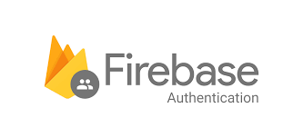
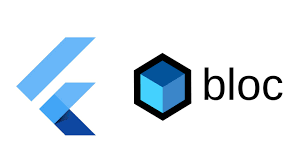
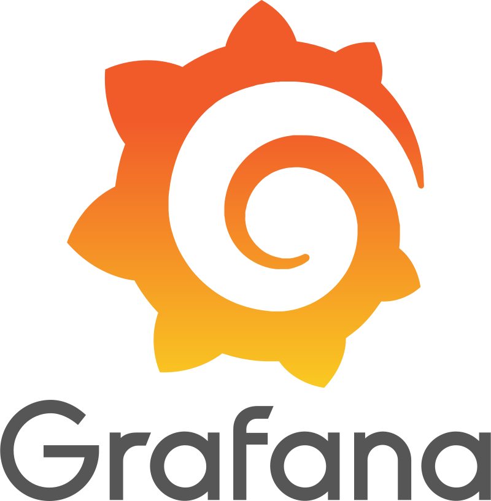

export const imageSize = "50%";
export const imageSize2 = "15%";

| Aspirations and Commitment                      |    
| ---------------------------------------|
| Embracing Design Patterns      | 
| Mastering Data Structures and Algorithms | 
| Advocating for Clean code|
| Implementing Test Driven Development|

| Programming Skill                      |                   | Implementations                                          |
| ---------------------------------------|------ | -------------------------------------------------------------------- |
| Good Coding Practice - Coding Style      | | DRY, CLEAN, Return Early Pattern, Implicit Boolean Expression                                                     |
| Battle-tested Logic - Experienced with Edge Cases||https://github.com/boraxpr/bitesofpy|
| Python - Pythonic syntaxes                          || https://github.com/boraxpr/automate_utils                            |

| New Web Technology Skill                      |                   | Implementations                                          |
| ------------------------------------------|--- | -------------------------------------------------------------------- |
| TailwindCSS                                || https://github.com/boraxpr/RickAndMorty |
| Material UI                               ||https://github.com/boraxpr/RickAndMorty|
| React (Hooks, Router)                      || https://github.com/boraxpr/RickAndMorty                              |
| NextJs (Client, Server, API), New /App Router  || https://github.com/boraxpr/webapp                                    |
| Firebase Authentication                   ||https://github.com/boraxpr/webapp|
|Supabase||https://github.com/boraxpr/nextauth-supabase-app-router|

|  Legacy Web Technology Skill (Solid foundation)            |                  | Implementations                                          |
| ------------------------------------------|--- | -------------------------------------------------------------------- |
| HTML CSS JS JQUERY BOOTSTRAP              || https://github.com/boraxpr/jQuery-bootstrap-calculator               |
| C# .NET CORE MVC-Razor Pages                         || https://github.com/boraxpr/SeniorLibrary                             |
| Java SpringBoot CRUD, JWT                 || https://github.com/boraxpr/SpringBoot_Gemini                         |
| Flutter BLoC, Kotlin                       || https://github.com/boraxpr/roll_a_dice                               |

| Database Administration Skill                                         |                                               |
| --------------------------------------------- | -------------------------------------------------------------------- |
| Advanced SQL, Stored Procedure         |                         |                                                                      |
| Data Visualization – Grafana Dashboard     | |                                                                      |
| NOSQL - MongoDB Atlas |||

| DevOps Skill                                   |      | Implementations                                               |
| ------------------------------------------|--- | -------------------------------------------------------------------- |
| Linux                                         |  | Debian-based, RPM-based, Advanced Shell                              |
| Elasticsearch-Kibana&Fleet - ELK Stack for Microservices Monitoring | | https://github.com/boraxpr/Dockerfile_Examples |
| Dockerize - Able to Deploy Apps on Docker and use Docker commands| |https://github.com/boraxpr/Dockerfile_Examples|

| Hardware-Propotyping Skill                          | Implementations                                                      |
| --------------------------------------------- | -------------------------------------------------------------------- |
| RaspberryPI, Arduino, Particle.io    | https://github.com/boraxpr/ESP32-RPI-monitoring-system               |
| | 7-segment, Ultrasonic module, Infrared camera module, Temperature module, LED, LCD |