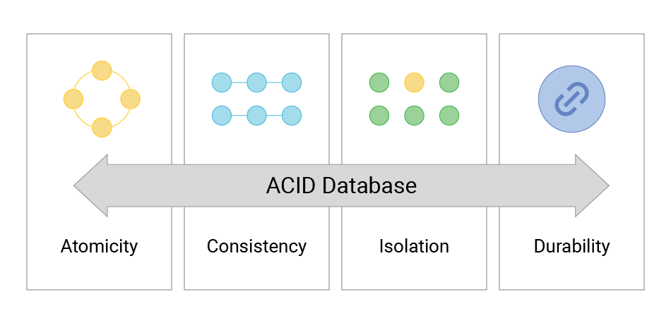

---

title: 'Atomicity is not magic'
published: 2025-11-29
tags: ["Databases", "Backend", "Distributed Systems"]
---

> image from : https://www.scylladb.com/glossary/acid-database/

CS courses love to say “RDBMS gives you atomicity.”  
Yeah, no. That’s the classroom version.

In reality, atomicity is not magic. It’s a fragile outcome created by a bunch of lower-level components doing the right thing at the right time. Miss one, and the whole idea falls apart.

Atomicity only holds because of:

- write-ahead logging  
- strict write ordering  
- real fsync behavior  
- crash-consistent metadata updates  
- durable page flushing  
- atomic rename semantics  
- predictable disk guarantees  

Break any of these and atomicity is gone.  
Run a database on fake-POSIX storage like SMB or Azure Files and you’ll see how quickly things go sideways.

RDBMS doesn’t “provide” atomicity.  
It depends on the filesystem being honest, consistent, and actually durable.

If the disk lies, atomicity dies.
