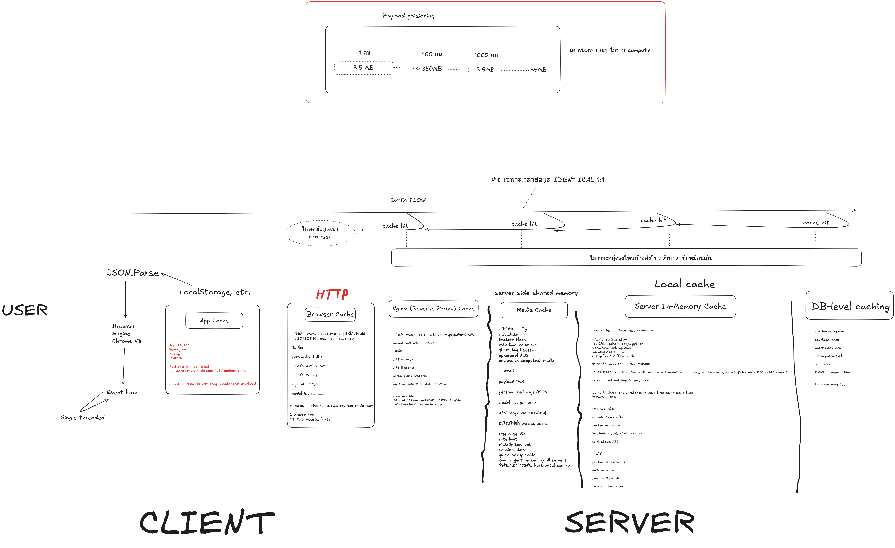

---

title: 'Stop Blindly Slapping Redis on Your Architecture: The Reality of Web Caching'
published: 2026-05-20
tags: ["Software Architecture"]
---

We have all seen it happen. An API endpoint gets slow. The database CPU starts spiking during peak hours. The immediate, knee-jerk reaction from the dev team?

*"Just put Redis in front of it."*  

In low-maturity software cultures, Redis is treated like a magical band-aid for bad queries and heavy payloads. But caching is not a single box you draw on a whiteboard. It is a multi-layered defensive strategy that spans the entire data flow from your database down to the user's browser.

If you actually understand the architecture diagram above, you will stop blindly inserting Redis into your system. Here is why.

## The Full Data Flow: More Than Just the Backend  

Look at the bottom flow of the diagram, moving right to left (Server to Client). There are at least six distinct layers where data can be cached:

1. **DB-Level Caching:** The database's own query cache and buffer pools.
2. **Server In-Memory Cache:** Local application memory (often faster than a network hop to a Redis cluster for static config data).
3. **Server-Side Shared Memory (Redis):** The famous distributed cache.
4. **Reverse Proxy (Nginx):** Caching at the gateway before the request even hits your application server.
5. **HTTP / Browser Cache:** Utilizing proper cache-control headers so the browser doesn't even make a network request.
6. **Client App Cache:** LocalStorage, IndexedDB, etc.

If you just drop Redis at layer 3, but you are sending identical, static data over the network every time because you ignored HTTP caching (layer 5) or Nginx caching (layer 4), you are still wasting bandwidth and compute. You solved the database bottleneck, but you are still failing at the systems level.

## The Real Killer: Payload Poisoning and the Single Thread

This brings us to the most important part of the diagram: the top box (**Payload Poisoning**) and the far left (**The Client**).

Look at the payload math:

* 1 row = 3.5 MB
* 100 rows = 350 MB
* 1000 rows = 3.5 GB

Let’s say you have a massive, unoptimized API response that is 350 MB. You cache it in Redis. Congratulations! Your backend now serves that massive JSON blob in 5 milliseconds instead of 5 seconds. The backend metrics look incredibly green.

But what happens on the client?

That 350 MB payload travels over the network and hits the browser. The browser has to run `JSON.parse()`. As the diagram points out, the Chrome V8 engine runs on a **single-threaded event loop**. Parsing a 350 MB JSON string will completely lock the main thread.

The user's screen freezes. They can't click, they can't scroll, the app becomes totally unresponsive.

You "fixed" the server with Redis, but the outcome is that the application is still broken for the end-user.

## The Write-Buffer Trap and the Illusion of Safety

Caching read-heavy data is one thing, but the moment you start using Redis to handle writes, you are playing a very dangerous game.

Let’s say you try to alleviate database pressure by writing data to Redis first, intending to sync it to your persistent database (Postgres, MSSQL, etc.) in the background. You get a lightning-fast response time, and the backend metrics look amazing.

But Redis is fundamentally an in-memory datastore. What happens if that Redis instance crashes or restarts before the data is committed to your persistent database?

You are doomed. That data is lost forever. You just returned a "200 OK" to the user, telling them their transaction was successful, but the reality evaporated the second the server dropped.

When you point this out, the immediate counter-argument is always: "Well, we will just make Redis highly available."

To do it "right" and guarantee zero data loss, you can't just spin up a simple Redis container. You now have to build and maintain a full Redis Cluster. You need primary nodes, replica nodes, sentinels for failover routing, and heavily tuned AOF (Append-Only File) persistence rules.

Look at the tradeoff you just made. To avoid doing the hard work of optimizing your database schema or your API payloads, you have:

    Introduced a highly complex distributed system into your stack.

    Skyrocketed your cloud infrastructure costs.

    Massively increased the operational burden and maintenance hours for the engineering team.

You didn't fix the architecture. You just bought a much more expensive, much more complicated problem.

## The Systems-Thinker Approach

Treating engineers like order-takers results in band-aid fixes. A slow API ticket comes in, a Redis cache ticket goes out.

Systems-thinkers look at the entire data lifecycle. Before you add the operational overhead of managing a Redis cluster, ask yourself:

* Can we optimize the database query first?
* Are we using HTTP cache headers properly?
* Are we over-fetching data and poisoning the payload?
* Will this payload block the V8 event loop on the frontend?

Redis is an incredible tool. But if your payload is bloated and your frontend is choking, a faster backend just means you are delivering the bottleneck to the client's browser a few milliseconds sooner.