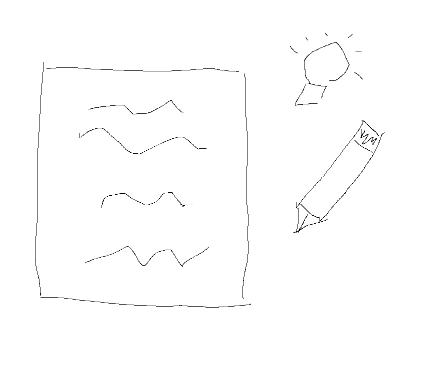

---

title: 'I'm not going to be a part of the Dead Internet: I'm back to 100% hand-written posts.'
published: 2026-03-15
tags: ["AI"]
---
  

The Dead internet is a phenomenon which majority of content online—previously crafted by humans—is now being automated by LLMS. In 2026, we're seeing "samey" contents all over social media. It all sounds the same; It all gives the same calls-to-action, key takeaways and advice.  

Jokingly, I sometimes even guess which model a writer used. Gemini, ChatGPT, Claude each have their own signature writing styles (I can feel it because I've been using all of them).  

It's not just images and videos; I highly suspected the majority of content creators are using AI to generate their writings. Even with friends, normies are starting to sound identical, which, in my book, defeats the purpose of creating content.  

Personally, I've been using AI to refine and edit my posts, but I've reached a point where I have a hard time expressing my authentic thoughts. Because I use AI so regularly, I'm officially quitting the habit of using it to "make my writing better." I might still ask for insights or basic grammar fixes, but no more automated writing. It defeats the purpose of the act itself.  

Would it still be "me" writing if 80% of it is AI?. For a long time, I convinced myself the answer was yes. But lately, it’s become difficult to tell which thoughts are actually mine.

From now on, my posts will be 100% hand-written.