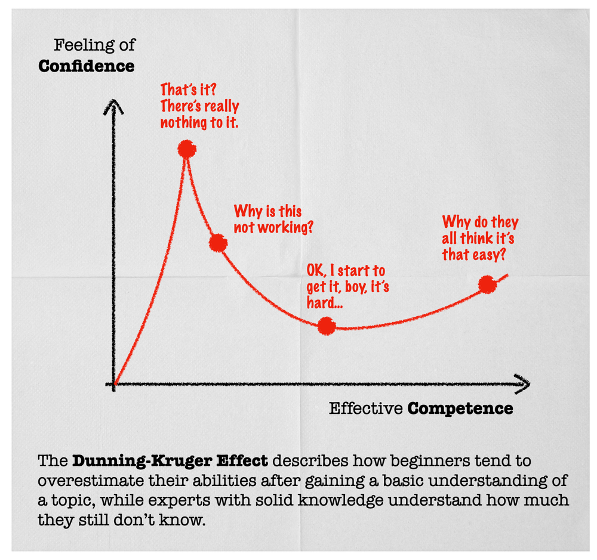

---

title: 'AI and the Illusion of Easy Work'
published: 2026-01-09
---

> image from : https://www.icopilots.com/strategyzer-and-the-dunning-kruger-effect/

There's a pattern I keep seeing lately, especially with AI and LLMs.

When people don't understand a field, they think it's easy.  
When they understand it a little, they think AI lets them replace it.  
When they actually understand it deeply, they stop making bold claims.

That's not opinion. That's Dunning–Kruger.

### The illusion of "easy work"

Non-coders say coding is easy now. AI writes code. Why hire developers?  

Some developers say business is easy now. AI writes marketing copy.  
"I'll just go solopreneur and bag the cash myself."  

Others say we don’t need mathematicians, lawyers, security engineers, designers, or analysts anymore. AI already knows more than humans. Who needs verification when confidence feels good?

This logic always comes from the same place: not knowing what the real work actually is.

People confuse **output** with **expertise**.

### What expertise really looks like

Expertise is not typing faster.  
It's not producing artifacts.  
It's not knowing syntax, formulas, or buzzwords.

Expertise is knowing:
- where things fail  
- which assumptions are dangerous  
- which edge cases matter  
- what cannot be trusted  
- how context changes decisions  
- when a "correct" answer is still wrong  

These are the parts AI struggles with the most. Not because the model is bad, but because these things live outside clean inputs and clean rules.

### LLMs make ignorance louder, not smarter

LLMs are extremely good at sounding right.  
They are extremely bad at telling you when they are wrong.

If you don't know a domain well enough, you will not spot hallucinations. You won't even know what to verify. You'll accept confident nonsense because it aligns with what you already believe.

That's why people who lack depth are often the most confident about replacement. They cannot see the gaps, so they assume there are none.

### Why "AI will replace X" is usually a tell

When someone says AI will replace a profession, what they are really saying is this:

"I don't understand what that profession actually does."

Security is not just writing secure code.  
Design is not just drawing interfaces.  
Business is not just writing pitches.  
Math is not just producing answers.

If any of those were true, those fields would have collapsed long before AI showed up.

### The uncomfortable conclusion

AI does not flatten the skill curve.  
It steepens it.

It removes shallow work and exposes shallow thinking.  
It rewards people who understand systems, constraints, and failure modes.  
It punishes people who mistake surface-level competence for mastery.

Experience doesn't make you louder.  
It makes you more careful.

If something looks easy, the honest move is not confidence.  
It's suspicion.

Because the moment everything feels obvious is usually the moment you've stopped seeing what matters.