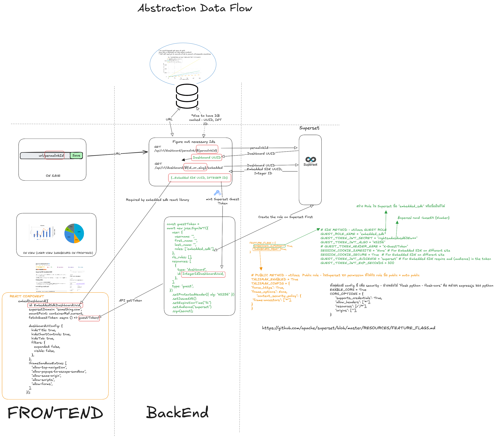

---

title: 'Escaping the Dashboard Trap: Reverse-Engineering Superset to Build a Golden Path'
published: 2026-05-20
tags: ["Software Architecture", "Platform Engineering"]
---

  

Once upon a time, my engineering team was stuck in a vicious cycle.

If you look across our internal applications, there was a glaring, expensive bottleneck: the dashboard feature. We were spending an ungodly amount of our development cycles building, tweaking, and maintaining bespoke analytics dashboards.

Worse than the initial build was the aftermath. Users love to ask developers to adjust dashboards. "Can we move this pie chart?" "Can we add a filter for last quarter?" "Can we change the X-axis?"

When your software culture treats engineers like order-takers for UI tweaks, you are burning money and accumulating tech debt. We needed to stop hardcoding charts and start building systems. We needed to empower the users to manage their own visualizations without deploying new code.

The obvious answer was a BI tool like Apache Superset. But dropping a third-party BI tool into a microservices architecture isn't a plug-and-play affair if you want a seamless user experience. I needed to create a Golden Path—a standardized, frictionless abstraction layer so any dev team could embed a dashboard without thinking about the underlying auth or infrastructure.

To do that, I had to reverse-engineer Superset's embedding architecture. Here is the blueprint of how we finally unlocked the team.
The Architecture: Decoupling the Frontend from the BI Engine

The core problem with naive integrations is tight coupling. If the frontend React app has to know exactly how Superset manages its internal IDs and authentication, you've failed.

I designed an Abstraction Data Flow (pictured above) that isolates the frontend from Superset entirely, using our backend as the secure broker.

Here is how the Golden Path works in practice:
1. The ID Resolution Layer

Instead of hardcoding Superset Dashboard IDs in our apps, the user simply provides a URL/permalink.
When the frontend saves this, our backend intercepts it and acts as a translation layer. It reaches out to Superset (GET /api/v1/dashboard/permalink/{permalinkId}) to figure out the necessary internal routing. It maps the permalink to the actual Dashboard UUID and, crucially, extracts the Embedded SDK UUID (the Integer ID required by the React library).

The frontend remains completely ignorant of Superset's database structure. It just asks for a dashboard and gets it.
2. Minting the Guest Token (The Security Broker)

Superset requires a secure handshake to embed iframes without forcing the user to log into the BI tool directly. Our backend handles this by minting a Superset Guest Token (a JWT).

```js
const guestToken = await new jose.SignJWT({
  user: {
    username: "",
    first_name: "",
    last_name: "",
  },
  roles: ["embedded_sdk"], // The critical role
  rls_rules: [],
  resources: [{
    type: "dashboard",
    id: IntegerIdDashboardUuid,
  }]
})
.setProtectedHeader({ alg: "HS256" })
.setIssuedAt()
.setExpirationTime("1h")
.setAudience("superset")
.sign(secret);
```

This payload is hyper-specific. It grants the temporary token access only to the specific dashboard the user requested, utilizing an embedded_sdk role we created specifically for this pipeline.

3. The Clean Frontend Component

Because the backend does all the heavy lifting, the developer experience (DX) for the frontend team is pristine. They just drop in a React component, pass it the ID from our API, and hand it a function to fetch the guestToken.

```js
embedDashboard({
    id: EmbeddedSdkDashboardUuid,
    supersetDomain: "something.com",
    mountPoint: containerRef.current,
    fetchGuestToken: async () => guestToken,
    dashboardUiConfig: {
        hideTitle: true,
        hideChartControls: true,
        hideTab: true
    }
})
```

The "Gotchas": Superset Configuration

Reverse-engineering this flow meant wrestling with Superset's security configurations. If you are trying to replicate this, you can't just mint a token and expect the iframe to work. You have to explicitly configure Superset to allow it.

Here are the critical environment configurations we had to enforce in superset_config.py:

1. Enable the Feature Flag

```py
FEATURE_FLAGS = {
    "EMBEDDED_SUPERSET": True
}
```

2. Configure the Guest Role & JWT

```py
GUEST_ROLE_NAME = "embedded_sdk"
GUEST_TOKEN_JWT_SECRET = "your-highly-secure-secret"
GUEST_TOKEN_JWT_ALGO = "HS256"
GUEST_TOKEN_HEADER_NAME = "X-GuestToken"

```

3. Break the Iframe Restrictions (Carefully)
By default, web security (Talisman/CORS) will block embedding to prevent clickjacking. We had to loosen these specifically for our internal domains:

```py
SESSION_COOKIE_SAMESITE = "None" 
SESSION_COOKIE_SECURE = True

TALISMAN_ENABLED = True
TALISMAN_CONFIG = {
    "force_https": True,
    "frame_options": None,
    "content_security_policy": {
        "frame-ancestors": ["*"] # Restrict this to your actual app domains in prod
    }
}

ENABLE_CORS = True
CORS_OPTIONS = {
    "supports_credentials": True,
    "allow_headers": ["*"],
    "resources": ["/*"],
    "origins": ["*"]
}

```

## The Outcome: From Order-Takers to Systems-Thinkers

By implementing this architecture, we completely eliminated the "dashboard adjustment" lifecycle from our development sprints.

Now, when a business user wants to change a visualization, they log into Superset directly, modify the charts using a drag-and-drop interface, and hit save. Because our embedded React component is just a dumb window looking at the Superset engine, the changes reflect instantly in the application. Zero code changes. Zero deployments.

We stopped wasting engineering talent on moving pie charts. By investing the upfront effort to build a scalable, decoupled foundation, we eradicated a massive source of tech debt and reclaimed our time to focus on actual platform engineering.