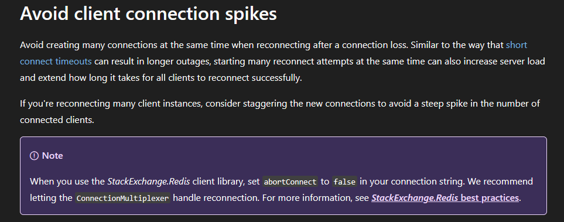

Picture this: I’m sitting in a room packed with the infrastructure team, the vendor, and our developers. Tension is high. We had just gone through a platform bridge change that caused IPs to cycle. Usually, this is a non-event. All the core services came back online perfectly normal.

But then, one specific service—an OutSystems application that connects to both Elasticsearch and Redis—started acting up. It became agonizingly slow and completely unresponsive.

I checked the logs, and this massive wall of text was staring back at me:

> The message timed out in the backlog attempting to send because no connection became available (5000ms) - Last Connection Exception: It was not possible to connect to the redis server(s). ConnectTimeout, command=EXISTS, timeout: 5000.........., v:xx.x.x.xxxxx (Please take a look at this article for some common client-side issues that can cause timeouts: https//stackexchange.github.io/StackExchange.Redis/Timeouts)

### The War Room Panic
When a system goes down, the initial reaction from Infrastructure is usually to throw raw compute power at it or mess with the network. Our senior infra guys were trying network denies, scaling up the Azure Managed Redis instance, the whole nine yards.

But I was sitting there watching the metrics thinking... where are all these retries coming from? Even after waiting 2 to 3 hours for Redis to scale up to a higher tier, the moment it came online, it filled up to max connections almost instantly. We weren't just getting traffic; we were getting hammered.

### The Detective Work
I decided to stop looking at the infrastructure and start looking at the code. I asked the team: "Where exactly is the Redis connection URL defined in OutSystems?"

We drilled down and found it. The connection wasn't using a native platform feature; it was a custom C# extension written by the vendor. And inside that handwritten plugin, they were using the popular StackExchange.Redis library.

A quick search led me to a specific GitHub issue: Setting abortConnect to false on Azure ([#1169](https://github.com/StackExchange/StackExchange.Redis/issues/1169)).

That issue pointed directly to the official Azure Cache for Redis documentation. When I read it, I had a massive "bruh" moment. The docs literally state:

### The "Aha!" Moment
Because abortConnect defaults to true, the moment our network dropped during the IP cycle, the app lost its mind. Instead of letting the ConnectionMultiplexer handle the reconnection gracefully in the background with exponential backoff, every single thread and instance of our app instantly panicked and tried to violently force a new connection to Redis at the exact same time.  

We had created a Cache Stampede (Thundering Herd).

The 2-3 hours we spent waiting for Infra to scale up Redis was completely useless because the second the server came up, our own application essentially DDoS'd it with thousands of simultaneous TCP handshake requests.

### The Resolution
To stop the bleeding immediately, we had to do the classic "turn it off and on again." We did a hard restart of both the OutSystems environment and the Azure Redis server simultaneously to clear the queued-up connection panic.

But my long-term recommendation to the vendor was crystal clear: You must set abortConnect=false in that plugin. If they don't, this exact nightmare will repeat the next time the network blips for even a second.

### Architectural Takeaways
Sitting in that room today absolutely strengthened my position on how we need to design systems moving forward. You can have the best cloud infrastructure in the world, but if your app architecture is brittle, you will go down.

Here are my two golden rules going forward:

1. Demote Redis from being a Single Point of Failure (SPOF)
Design your systems with the understanding that Redis is just a "Cache", not the main pillar of truth. Do not design an application expecting Redis to have 100% uptime. There should always be an alternative path or fallback to the primary database so the app can survive degraded performance.

2. Implement Circuit Breakers
You absolutely must have a code-level switch to catch an app that keeps retrying a dead service. When retries or timeouts reach a certain threshold, the circuit must "break" to limit connections. This protects your downstream services (like Redis) from getting DDoS'd by your own app while they are trying to recover.

Sometimes, the biggest threats to your infrastructure aren't external hackers; it's your own application's retry logic.