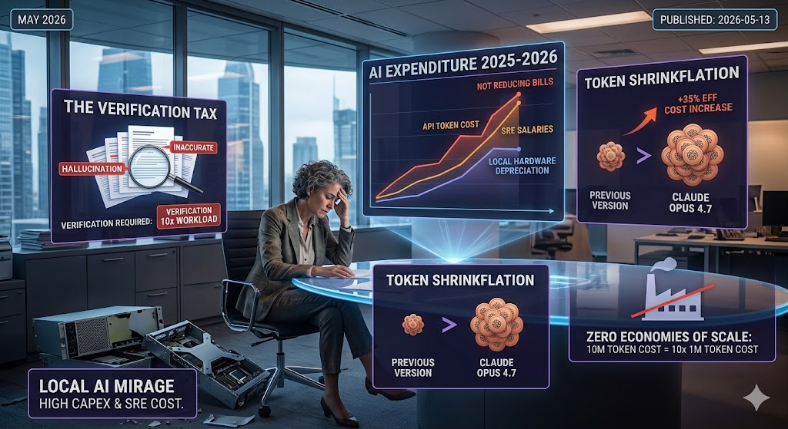

---

title: 'Why AI does not reduce your bills as a cost reduction engine. Why AI fails in 2026.'
published: 2026-05-13
tags: ["AI"]
---

## The Verification Tax: Why Faster Generation Equals Slower Pipelines

> The Consumption Burden: "Generating is Fast, Verifying is Slow"

Currently, the majority of tokens are being spent to create artifacts for humans—such as text documents, spreadsheets, PowerPoint slides, and images.

This negatively impacts overall cost reduction. Many companies aim to reduce human workload and cut costs, operating under the assumption that AI will magically do it for them. Reality shows otherwise. More documents, spreadsheets, and slides are being created right now than at any other point in human history. Who is supposed to read them? Obviously, humans.

Therefore, current AI usage essentially creates even more work for humans to verify and process. Using AI to generate an artifact is fast, but the reader cannot rely on AI to summarize it while reliably retaining the original meaning—and at times, the generated artifact is flat-out wrong.  

## Token Shrinkflation: The Myth of Falling AI Costs

> Token "Shrinkflation" and Hidden Costs

People often think that AI will provide marginal cost savings similar to building a factory. With a factory, there is an initial fixed cost to build, followed by maintenance costs. That is how physical manufacturing works.

Sadly, AI does not work like that. While some claim the cost of tokens will decrease, reality shows otherwise. For example, with Claude Opus 4.7, Anthropic presents a standard pricing table stating that the dollar cost per million tokens remains the same. However, what isn't on the table is the change to the tokenizer. In layman's terms, they are not increasing the token price on paper, but they are actively changing how tokens are counted. In previous versions, three words might have been counted as one token. After migrating to the newer version, the exact same input suddenly costs you 35% more in dollars.  
  

What does this mean? If this trend continues, you can expect token bills to keep creeping upward alongside planned obsolescence (actively shutting down older, cheaper model versions). Providers can also alter tokenizers, cache timers, and other backend mechanics at will, directly inflating your bill. AI companies like OpenAI and Anthropic face immense financial pressure to justify valuations and IPO soon.

AI costs are not fixed. They are not linear. They are potentially exponential.

## The "Local AI" Mirage: Self-hosting won't save you

> "If the API is too expensive, we'll just run it locally on our own GPUs." — Famous last words of a CTO.

- The CapEx Trap: People compare a $0.01 token bill to a $0 electricity bill, but they ignore the massive Capital Expenditure. In 2026, high-end hardware (H100s or the newer B200s) is still supply-constrained and carries a massive premium. By the time you break even on the hardware vs. the tokens, the hardware is obsolete.
- The SRE Overhead: Hosting a "frontier-class" model isn't a "set it and forget it" task. It requires a dedicated team of SREs and ML Engineers to maintain the stack, optimize inference (vLLM, TensorRT-LLM), and manage the infrastructure.
  - The Reality: You might save $10k a month on tokens only to spend $30k a month on the salary of the engineer required to keep the local cluster from crashing.
- The Intelligence Gap: Let’s be honest—Llama 4 (or whatever the current open-weight king is) is impressive, but for the "Verification" problem mentioned above, you need the highest level of reasoning possible to reduce human error. Local models often lack that final 5-10% of "common sense" that prevents hallucinations.
  - If a local model is 10% cheaper but creates 20% more "Artifact Slop" for humans to check, your total cost of business actually increased.

---

## Conclusion: Stop Treating Intelligence Like a Commodity

People often think that AI will provide marginal cost savings similar to building a factory—a high fixed cost upfront, followed by cheap maintenance and mass production. A factory has true economies of scale: the 10,000th widget is always cheaper to produce than the first.

Sadly, AI APIs are utilities with zero economies of scale for the end-user. The 10-millionth token costs exactly the same as the first. When you combine the Verification Tax of checking AI-generated slop, the Token Shrinkflation from backend API updates, and the massive CapEx of the Local AI Mirage, the math becomes clear. It is no surprise that recent MIT data shows 95% of AI pilots are delivering zero measurable P&L impact.

Until organizations stop treating AI as a magical, infinitely scalable cost-cutter and start engineering strict, governed pipelines that control token flow, AI will remain a net-negative on the balance sheet. The industry wants order-takers to just plug in APIs, but surviving the AI ecosystem requires systems-thinkers.
